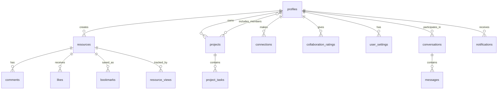

# Supabase Schema Documentation - Knowledge Hub

This document outlines the complete database schema for the Knowledge Hub application.

## Overview

The Knowledge Hub uses a comprehensive database schema designed to support collaborative knowledge sharing, project management, and professional networking features.

## Database Tables

### 1. Authentication & User Management

#### `profiles`
User profile information and public data.

```sql
CREATE TABLE public.profiles (
    id UUID PRIMARY KEY DEFAULT gen_random_uuid(),
    name TEXT NOT NULL,
    email TEXT NOT NULL,
    avatar_url TEXT,
    bio TEXT,
    skills TEXT[],
    reputation INTEGER DEFAULT 0,
    created_at TIMESTAMP WITH TIME ZONE DEFAULT now(),
    updated_at TIMESTAMP WITH TIME ZONE DEFAULT now()
);
```

**RLS Policies:**
- Public read access (except email for non-owners)
- Users can insert/update their own profile only

#### `user_settings`
User preferences and application settings.

```sql
CREATE TABLE public.user_settings (
    id UUID PRIMARY KEY DEFAULT gen_random_uuid(),
    user_id UUID NOT NULL,
    dark_mode_preference BOOLEAN,
    push_notifications BOOLEAN DEFAULT false,
    weekly_digest BOOLEAN DEFAULT true,
    collaboration_alerts BOOLEAN DEFAULT true,
    public_profile BOOLEAN DEFAULT true,
    analytics_tracking BOOLEAN DEFAULT true,
    created_at TIMESTAMP WITH TIME ZONE DEFAULT now(),
    updated_at TIMESTAMP WITH TIME ZONE DEFAULT now()
);
```

**RLS Policies:**
- Users can view/modify their own settings only

### 2. Knowledge Resources

#### `resources`
Core knowledge articles and resources.

```sql
CREATE TABLE public.resources (
    id UUID PRIMARY KEY DEFAULT gen_random_uuid(),
    title TEXT NOT NULL,
    description TEXT,
    content TEXT,
    author_id UUID,
    tags TEXT[],
    views INTEGER DEFAULT 0,
    likes INTEGER DEFAULT 0,
    comments_count INTEGER DEFAULT 0,
    read_time TEXT,
    created_at TIMESTAMP WITH TIME ZONE DEFAULT now(),
    updated_at TIMESTAMP WITH TIME ZONE DEFAULT now()
);
```

**RLS Policies:**
- Public read access
- Authenticated users can create resources
- Authors can update/delete their own resources

#### `comments`
Comments on resources for discussion.

```sql
CREATE TABLE public.comments (
    id UUID PRIMARY KEY DEFAULT gen_random_uuid(),
    resource_id UUID,
    author_id UUID,
    parent_id UUID,
    content TEXT NOT NULL,
    created_at TIMESTAMP WITH TIME ZONE DEFAULT now()
);
```

**RLS Policies:**
- Public read access
- Authenticated users can create comments
- Authors can update/delete their own comments

#### `likes`
User likes on resources.

```sql
CREATE TABLE public.likes (
    id UUID PRIMARY KEY DEFAULT gen_random_uuid(),
    user_id UUID NOT NULL,
    resource_id UUID NOT NULL,
    created_at TIMESTAMP WITH TIME ZONE DEFAULT now()
);
```

**RLS Policies:**
- Users can view only their own likes
- Users can insert/delete their own likes

#### `bookmarks`
User bookmarks for saving resources.

```sql
CREATE TABLE public.bookmarks (
    id UUID PRIMARY KEY DEFAULT gen_random_uuid(),
    user_id UUID,
    resource_id UUID,
    created_at TIMESTAMP WITH TIME ZONE DEFAULT now()
);
```

**RLS Policies:**
- Users can view/manage their own bookmarks only

#### `resource_views`
Track resource view analytics.

```sql
CREATE TABLE public.resource_views (
    id UUID PRIMARY KEY DEFAULT gen_random_uuid(),
    resource_id UUID NOT NULL,
    user_id UUID,
    ip_address TEXT,
    created_at TIMESTAMP WITH TIME ZONE DEFAULT now()
);
```

**RLS Policies:**
- Insert-only access for tracking views

### 3. Project Management

#### `projects`
Collaborative projects and workspaces.

```sql
CREATE TABLE public.projects (
    id UUID PRIMARY KEY DEFAULT gen_random_uuid(),
    name TEXT NOT NULL,
    description TEXT,
    owner_id UUID,
    members UUID[],
    status TEXT DEFAULT 'active',
    deadline TIMESTAMP WITH TIME ZONE,
    created_at TIMESTAMP WITH TIME ZONE DEFAULT now(),
    updated_at TIMESTAMP WITH TIME ZONE DEFAULT now()
);
```

**RLS Policies:**
- Project members can view projects
- Owners can create/update/delete projects

#### `project_tasks`
Tasks within projects for organization.

```sql
CREATE TABLE public.project_tasks (
    id UUID PRIMARY KEY DEFAULT gen_random_uuid(),
    project_id UUID,
    title TEXT NOT NULL,
    description TEXT,
    assignee_id UUID,
    status TEXT DEFAULT 'todo',
    due_date TIMESTAMP WITH TIME ZONE,
    created_at TIMESTAMP WITH TIME ZONE DEFAULT now(),
    updated_at TIMESTAMP WITH TIME ZONE DEFAULT now()
);
```

**RLS Policies:**
- Project members can view/manage tasks

### 4. Collaboration & Networking

#### `connections`
Professional connections between users.

```sql
CREATE TABLE public.connections (
    id UUID PRIMARY KEY DEFAULT gen_random_uuid(),
    requester_id UUID NOT NULL,
    addressee_id UUID NOT NULL,
    status TEXT DEFAULT 'pending',
    created_at TIMESTAMP WITH TIME ZONE DEFAULT now(),
    updated_at TIMESTAMP WITH TIME ZONE DEFAULT now()
);
```

**RLS Policies:**
- Users can view their own connections
- Users can create connection requests
- Users can update received requests

#### `collaboration_ratings`
Ratings for collaboration quality.

```sql
CREATE TABLE public.collaboration_ratings (
    id UUID PRIMARY KEY DEFAULT gen_random_uuid(),
    rater_id UUID NOT NULL,
    rated_user_id UUID NOT NULL,
    rating INTEGER NOT NULL,
    comment TEXT,
    created_at TIMESTAMP WITH TIME ZONE DEFAULT now(),
    updated_at TIMESTAMP WITH TIME ZONE DEFAULT now()
);
```

**RLS Policies:**
- Users can view ratings they gave or received
- Users can rate their collaborators
- Users can update their own ratings

### 5. Communication

#### `conversations`
Private conversations between users.

```sql
CREATE TABLE public.conversations (
    id UUID PRIMARY KEY DEFAULT gen_random_uuid(),
    participant_1 UUID NOT NULL,
    participant_2 UUID NOT NULL,
    last_message_at TIMESTAMP WITH TIME ZONE DEFAULT now(),
    created_at TIMESTAMP WITH TIME ZONE DEFAULT now(),
    updated_at TIMESTAMP WITH TIME ZONE DEFAULT now()
);
```

**RLS Policies:**
- Participants can view/create conversations

#### `messages`
Messages within conversations.

```sql
CREATE TABLE public.messages (
    id UUID PRIMARY KEY DEFAULT gen_random_uuid(),
    conversation_id UUID NOT NULL,
    sender_id UUID NOT NULL,
    content TEXT NOT NULL,
    is_read BOOLEAN DEFAULT false,
    created_at TIMESTAMP WITH TIME ZONE DEFAULT now(),
    updated_at TIMESTAMP WITH TIME ZONE DEFAULT now()
);
```

**RLS Policies:**
- Conversation participants can view/send messages

### 6. System & Support

#### `notifications`
System notifications for users.

```sql
CREATE TABLE public.notifications (
    id UUID PRIMARY KEY DEFAULT gen_random_uuid(),
    user_id UUID,
    type TEXT NOT NULL,
    message TEXT NOT NULL,
    link TEXT,
    is_read BOOLEAN DEFAULT false,
    created_at TIMESTAMP WITH TIME ZONE DEFAULT now()
);
```

**RLS Policies:**
- Users can view their own notifications
- System can insert notifications
- Users can update their notifications

#### `help_articles`
Help documentation and support articles.

```sql
CREATE TABLE public.help_articles (
    id UUID PRIMARY KEY DEFAULT gen_random_uuid(),
    slug TEXT NOT NULL UNIQUE,
    title TEXT NOT NULL,
    description TEXT,
    content TEXT NOT NULL,
    category TEXT NOT NULL,
    tags TEXT[],
    is_published BOOLEAN DEFAULT true,
    views INTEGER DEFAULT 0,
    created_at TIMESTAMP WITH TIME ZONE DEFAULT now(),
    updated_at TIMESTAMP WITH TIME ZONE DEFAULT now()
);
```

**RLS Policies:**
- Public read access for published articles

## Database Functions

### 1. `update_updated_at_column()`
Automatically updates the `updated_at` timestamp when records are modified.

```sql
CREATE OR REPLACE FUNCTION public.update_updated_at_column()
RETURNS TRIGGER AS $$
BEGIN
  NEW.updated_at = now();
  RETURN NEW;
END;
$$ LANGUAGE plpgsql SET search_path = public;
```

### 2. `get_collaboration_score(user_id UUID)`
Calculates the average collaboration rating for a user.

```sql
CREATE OR REPLACE FUNCTION public.get_collaboration_score(user_id UUID)
RETURNS NUMERIC AS $$
  SELECT COALESCE(ROUND(AVG(rating)::decimal, 2), 0.0)
  FROM collaboration_ratings
  WHERE rated_user_id = user_id;
$$ LANGUAGE sql STABLE SECURITY DEFINER SET search_path = 'public';
```

### 3. `update_resource_counts()`
Updates resource statistics (likes, comments, views) when related records change.

### 4. `update_conversation_last_message()`
Updates conversation timestamp when new messages are added.

### 5. `handle_new_user_dark_mode()`
Creates user settings when new users sign up, including dark mode preference.

### 6. Public Profile Functions
- `get_public_profile(profile_id UUID)`
- `get_public_profile_data(profile_id UUID)`
- `get_public_profiles_list()`

## Triggers

The schema includes several triggers for maintaining data consistency:

1. **Update Timestamps**: Automatically update `updated_at` fields
2. **Resource Counts**: Update likes, comments, and views counters
3. **Conversation Updates**: Update last message timestamps
4. **User Onboarding**: Create default user settings on signup

## Security Features

### Row Level Security (RLS)
All tables have RLS enabled with comprehensive policies ensuring:
- Data isolation between users
- Proper access control for collaborative features
- Public access where appropriate (published content)
- Secure authentication checks

### Security Definer Functions
Functions are marked as `SECURITY DEFINER` where needed to:
- Prevent infinite recursion in RLS policies
- Enable secure data access patterns
- Maintain performance while ensuring security

## Relationships & Data Flow



## Performance Considerations

- **Indexes**: Key columns are indexed for optimal query performance
- **Counters**: Denormalized counters (likes, views, comments) for fast display
- **Array Columns**: Used for tags, skills, and project members for flexibility
- **Triggers**: Maintain data consistency automatically
- **Security Functions**: Prevent recursive RLS policy issues

## Migration Notes

When deploying this schema:

1. Enable RLS on all tables
2. Create functions before dependent triggers
3. Set up authentication triggers for user onboarding
4. Configure real-time subscriptions as needed
5. Add appropriate indexes for your query patterns

This schema provides a solid foundation for a collaborative knowledge platform with room for future expansion and feature additions.